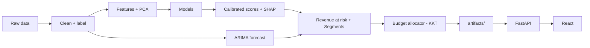

# Customer Churn & Revenue Risk Platform

From raw data to a calibrated churn model, revenue at risk, a segment-aware retention budget, a FastAPI backend and a React dashboard.

  

Course project for MAC F312 Foundations of Data Science (BITS Pilani Dubai), also built as portfolio work.

## Problem

Customers who churn are cheaper to keep than to replace, but retention budgets are finite. Reacting after a customer leaves is too late. Flagging every customer who looks risky wastes money on those who would have stayed. The goal is to find who is likely to leave, estimate how much revenue that puts at risk, and spend a fixed budget where it saves the most.

## The two claims

1. **Calibration matters more than ranking when churn scores drive spending.** A model with high AUC but miscalibrated probabilities misallocates budget.
2. **Segment-aware allocation beats uniform discounting at equal budget.**

## Architecture



## Pipeline

| # | Step | What it involves | Depends on | Output | Owner | Status |
|---|---|---|---|---|---|---|
| 1 | Setup + dataset | Repo, config, Makefile. Dataset chosen against hard rules (real churn labels, timestamps, revenue per customer, behavioural features, ≥10k customers). Data contracts agreed. | none | repo, dataset choice, contracts | TBD | ⬜ |
| 2 | Data + EDA | Ingestion + schema checks, monthly snapshot labeling, cleaning (imputation, outlier capping, Box-Cox/Yeo-Johnson). EDA: churn by tier and over time, correlation + VIF, engagement × support co-occurrence test. | 1 | clean labeled data, EDA report | TBD | ⬜ |
| 3 | Features + PCA + imbalance | Recency, tenure, usage trend slope, payment and revenue features. Time-based split + expanding-window CV. PCA with interpreted loadings. Class weights vs SMOTE vs undersampling. | 2 | feature matrix, PCA, split | TBD | ⬜ |
| 4 | Modeling + calibration + SHAP | Logistic regression MLE vs MAP, Naive Bayes, Random Forest, XGBoost, LSTM. PR-AUC, Brier, ECE. Platt/isotonic calibration, cost-based threshold, SHAP top 5 drivers, model card. | 3 | `scores.parquet`, model | TBD | ⬜ |
| 5 | Revenue risk + forecast + segments | Revenue at risk = P(churn) × customer value. ARIMA vs moving-average baseline. GMM segments chosen by BIC, crossed with value tiers. | 4 (ARIMA needs only 2) | forecast, segments | TBD | ⬜ |
| 6 | Budget allocation | Lagrangian/KKT solver + gradient-descent check, offer matching per segment, reallocation loop. Strategy comparison, sensitivity analysis, calibrated vs uncalibrated test. | 4, 5 (solver can use mock data) | `allocations.parquet`, allocation report | TBD | ⬜ |
| 7 | App + ship | FastAPI endpoints + React dashboard (Overview, Client Lookup, Budget Planner, Model & Data). Tests + CI, Docker, deploy, final report. | 6 (can start on mock data after 1) | live app, docs | TBD | ⬜ |

**Status legend:** ⬜ not started · 🟨 in progress · ✅ done

Owners update this table in their PRs.

## Syllabus coverage

| Course topic | Step |
|---|---|
| Bayesian inference, MLE vs MAP | 4 |
| PCA | 3 |
| Time series (ARIMA, ACF/PACF, moving averages) | 5 |
| LSTM | 4 |
| Constrained optimization (Lagrange multipliers, KKT, gradient descent) | 6 |
| Data visualization | 2, 7 |

## Tech stack

| Area | Tools |
|---|---|
| Data + ML | Python 3.11, pandas, scikit-learn, imbalanced-learn, XGBoost, SHAP, statsmodels, PyTorch |
| API | FastAPI, Pydantic |
| Frontend | Vite, React, TypeScript, Tailwind, shadcn/ui, TanStack Query, Recharts |
| Ops | Docker, GitHub Actions |

## Repo structure

```
.
├── configs/config.yaml            # paths, seed, windows, budget, risk bands
├── data/{raw,interim,processed}/  # datasets (gitignored)
├── src/churn/                     # all ML and business logic
│   └── models/                    # model training and calibration code
├── src/api/                       # FastAPI app: validates and calls src/churn
│   └── routers/                   # one router per resource
├── frontend/                      # React dashboard (step 7)
├── notebooks/                     # EDA and exploration
├── reports/                       # EDA, allocation and final reports
├── artifacts/                     # step outputs: parquet files, models (gitignored)
├── scripts/                       # helpers, e.g. make_mocks.py
├── tests/                         # pytest
├── docs/contracts.md              # data and API contracts (v0)
├── requirements.txt
├── Makefile
└── README.md
```

## Getting started

```bash
git clone <repo-url>
cd <repo>
python -m venv .venv
source .venv/bin/activate        # Windows: .venv\Scripts\activate
pip install -r requirements.txt
```

- Put the raw dataset in `data/raw/` (gitignored). The chosen dataset is documented after step 1.
- `make help` lists all targets.
- `make mocks` writes fake artifacts to `artifacts/mock/` so the app track can start early.

| Command | Available from |
|---|---|
| `make data` | step 2 |
| `make features` | step 3 |
| `make train` | step 4 |
| `make risk` | step 5 |
| `make allocate` | step 6 |
| `make api`, `make web` | step 7 |

## Ground rules

- All ML and business logic lives in `src/churn/`. The API only validates and calls. React only displays.
- No leakage: transformers, PCA and SMOTE fit on the training window only. Splits are time-based, never random shuffles.
- All thresholds, dates, seeds and budgets live in `configs/config.yaml`.
- Each step writes outputs to `artifacts/` or `reports/`. Downstream steps read files and never retrain.
- Work on branches named `step-N-short-name`, open a PR, and the other person reviews.

## Results

*Filled in after steps 4 and 6.*

| Model | PR-AUC | Brier | ECE |
|---|---|---|---|
| Logistic regression (MLE) | – | – | – |
| Logistic regression (MAP) | – | – | – |
| Naive Bayes | – | – | – |
| Random Forest | – | – | – |
| XGBoost | – | – | – |
| LSTM | – | – | – |

**Strategy comparison (equal budget):** *to be added after step 6.*

## Limitations

- Offer response curves are assumptions, not measured uplift; see sensitivity analysis in step 6.
- TBD: dataset-specific limits (churn definition, time span, single-company data).
- TBD: calibration drift over time is not monitored.

## Team

| Name | Owned steps |
|---|---|
| TBD | 1, 2, 3, 4 |
| TBD | 5, 6, 7 |
