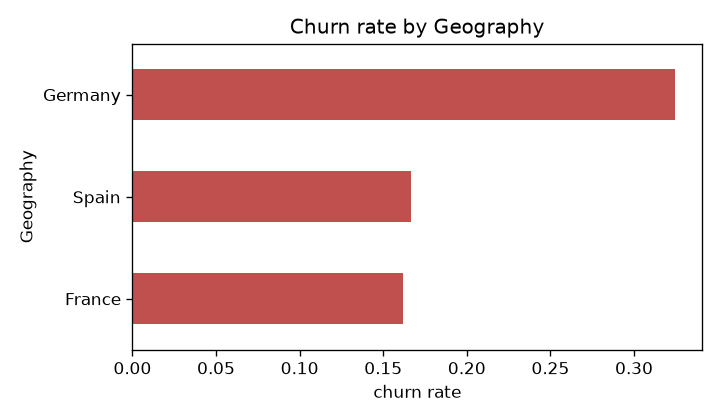
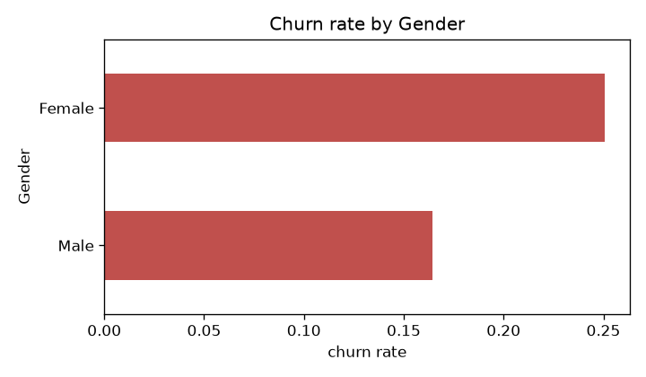
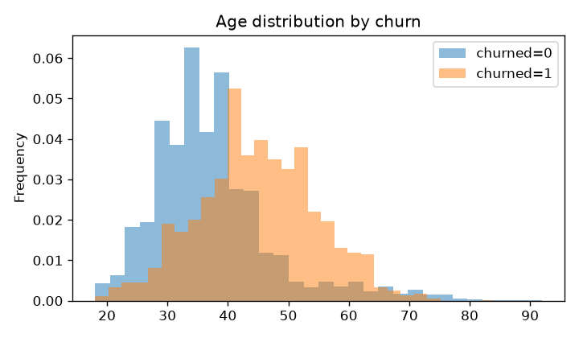
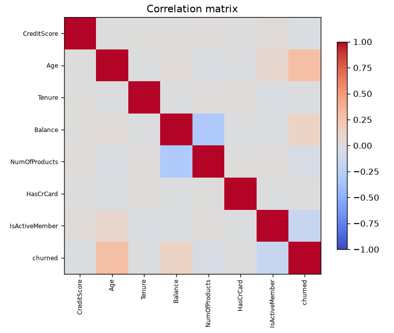

# EDA report

Dataset: `data/raw/Churn_Modelling.csv` (10000 rows, 10000 unique customers)
Churn rate: **20.4%** | null cells: 0

## Churn rate by category

- **Geography**: Germany 32.4%, Spain 16.7%, France 16.2%
- **Gender**: Female 25.1%, Male 16.5%

## VIF (collinearity)

| feature        |   VIF |
|:---------------|------:|
| NumOfProducts  |  1.1  |
| Balance        |  1.1  |
| IsActiveMember |  1.01 |
| Age            |  1.01 |
| Tenure         |  1    |
| HasCrCard      |  1    |
| CreditScore    |  1    |

## Figures

## Engagement co-occurrence

- Mean products held: active=1.54, inactive=1.52
- Churn among IsActiveMember=0: 26.9%
- Churn among IsActiveMember=1: 14.3%

Note: dataset has no timestamps; the temporal co-occurrence test from the README plan is replaced by the static engagement comparison above.